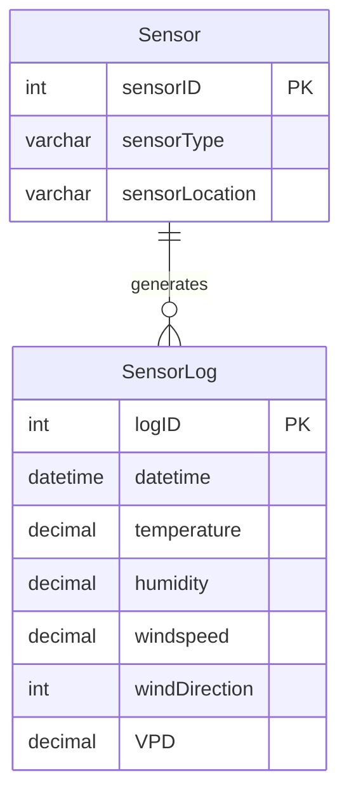

```mermaid
erDiagram

    Sensor {
        int sensorID PK
        varchar sensorType
        varchar sensorLocation
    }

    SensorLog {
        int logID PK
        datetime datetime
        decimal temperature
        decimal humidity
        decimal windspeed
        int windDirection
        decimal VPD
    }

    Sensor ||--o{ SensorLog : generates
```
