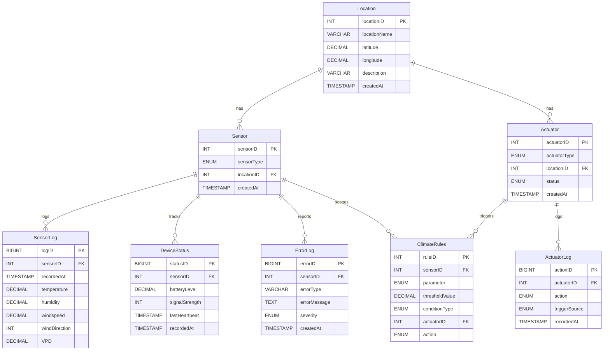

```mermaid

erDiagram

    Location {
        INT locationID PK
        VARCHAR locationName
        DECIMAL latitude
        DECIMAL longitude
        VARCHAR description
        TIMESTAMP createdAt
    }

    Sensor {
        INT sensorID PK
        ENUM sensorType
        INT locationID FK
        TIMESTAMP createdAt
    }

    SensorLog {
        BIGINT logID PK
        INT sensorID FK
        TIMESTAMP recordedAt
        DECIMAL temperature
        DECIMAL humidity
        DECIMAL windspeed
        INT windDirection
        DECIMAL VPD
    }

    DeviceStatus {
        BIGINT statusID PK
        INT sensorID FK
        DECIMAL batteryLevel
        INT signalStrength
        TIMESTAMP lastHeartbeat
        TIMESTAMP recordedAt
    }

    ErrorLog {
        BIGINT errorID PK
        INT sensorID FK
        VARCHAR errorType
        TEXT errorMessage
        ENUM severity
        TIMESTAMP createdAt
    }

    Actuator {
        INT actuatorID PK
        ENUM actuatorType
        INT locationID FK
        ENUM status
        TIMESTAMP createdAt
    }

    ActuatorLog {
        BIGINT actionID PK
        INT actuatorID FK
        ENUM action
        ENUM triggerSource
        TIMESTAMP recordedAt
    }

    ClimateRules {
        INT ruleID PK
        INT sensorID FK
        ENUM parameter
        DECIMAL thresholdValue
        ENUM conditionType
        INT actuatorID FK
        ENUM action
    }

    Location ||--o{ Sensor       : "has"
    Location ||--o{ Actuator     : "has"
    Sensor   ||--o{ SensorLog    : "logs"
    Sensor   ||--o{ DeviceStatus : "tracks"
    Sensor   ||--o{ ErrorLog     : "reports"
    Sensor   ||--o{ ClimateRules : "scopes"
    Actuator ||--o{ ActuatorLog  : "logs"
    Actuator ||--o{ ClimateRules : "triggers"

```
